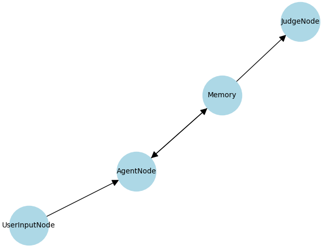

# Multi-Agent Debate

## 📝 Introduction

**Multi-Agent Debate** is a Python-based system that implements a debate framework where multiple AI agents argue collaboratively and competitively to arrive at the best possible decision or output. It is inspired by AI safety and alignment research, utilising structured debates to enhance reasoning quality.

---

## 📑 Table of Contents

- [Introduction](#-introduction)
- [Features](#-features)
- [Project Structure](#-project-structure)
- [Installation](#-installation)
- [Usage](#-usage)
- [Sample Interaction](#-sample-interaction)
- [Debate Flow DAG](#-debate-flow-dag)
- [Technologies Used](#-technologies-used)
- [Contact](#-contact)
---

## 🚀 Features

- Multiple AI agents debating in configurable rounds.
- Modular agent class for implementing custom strategies.
- Simple CLI-based interface to observe debates.
- Logs all debates for analysis and reproducibility.
- Easily extendable to integrate with large language models for realistic arguments.

---

## 🏗️ Project Structure

```
Multi-Agent-Debate/
│
├── debate.py           # Core debate loop and environment logic
├── debate_agent.py     # DebateAgent class definition
├── debate_agent.png    # Diagram of DebateAgent class architecture
├── debate.py           # Script to run debates with multiple agents
├── requirements.txt    # Required Python packages
└── README.md           # Project documentation
```

---

## ⚙️ Installation

1. **Clone the repository**:

```bash
git clone https://github.com/samp1012/Multi-Agent-Debate.git
cd Multi-Agent-Debate
```

2. **(Optional) Create a virtual environment**:

```bash
python -m venv venv
source venv/bin/activate   # Windows: venv\Scripts\activate
```

3. **Install dependencies**:

```bash
pip install -r requirements.txt
```

---

## 💡 Usage

Run the main debate script:

```bash
python run_debate.py
```

Debate logs will be saved (once logging is implemented) for review and analysis.

---

## 🎯 Sample Interaction

```
Starting debate with 3 agents for 5 rounds.
Round 1:
Agent A: Presents argument X...
Agent B: Counterargument focusing on Y...
...
Final Decision: Agent B's argument is selected as the conclusion.
```

---

## 🗂️ Debate Flow DAG



---

## 🧠 Technologies Used

- **Ollama**
  - For integrating large language models as agents within the debate framework.
- **NetworkX**
  - For generating and visualising the debate flow DAGs programmatically.
- **Python logging module**
  - For recording debate logs systematically for analysis and reproducibility.
---

## 📬 Contact

For feedback, suggestions, or contributions:

- GitHub: [samp1012](https://github.com/samp1012)
- Email: [samparkadas@gmail.com](mailto:samparkadas@gmail.com)
- LinkedIn: [Samparka Das](https://www.linkedin.com/in/samparka-das-b4317726b/)

---
